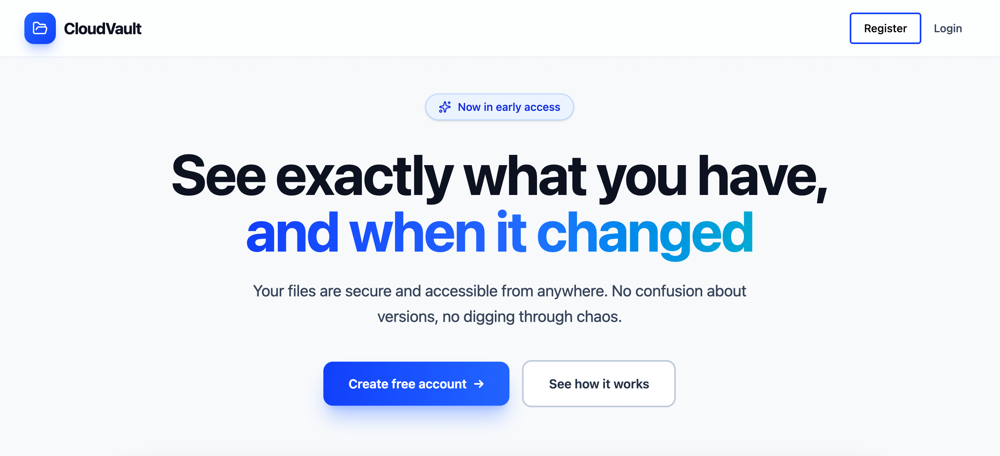
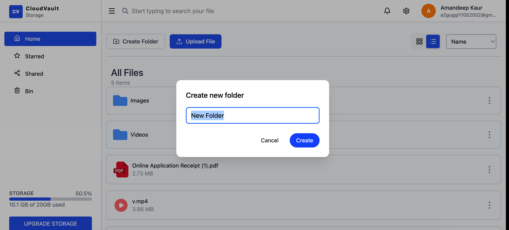
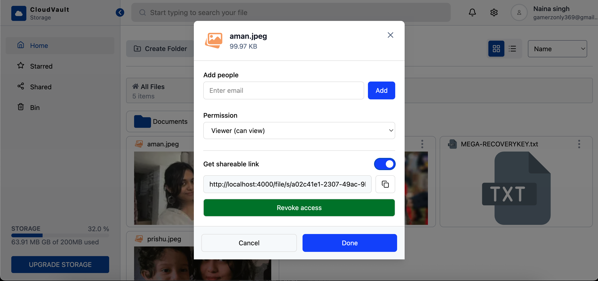
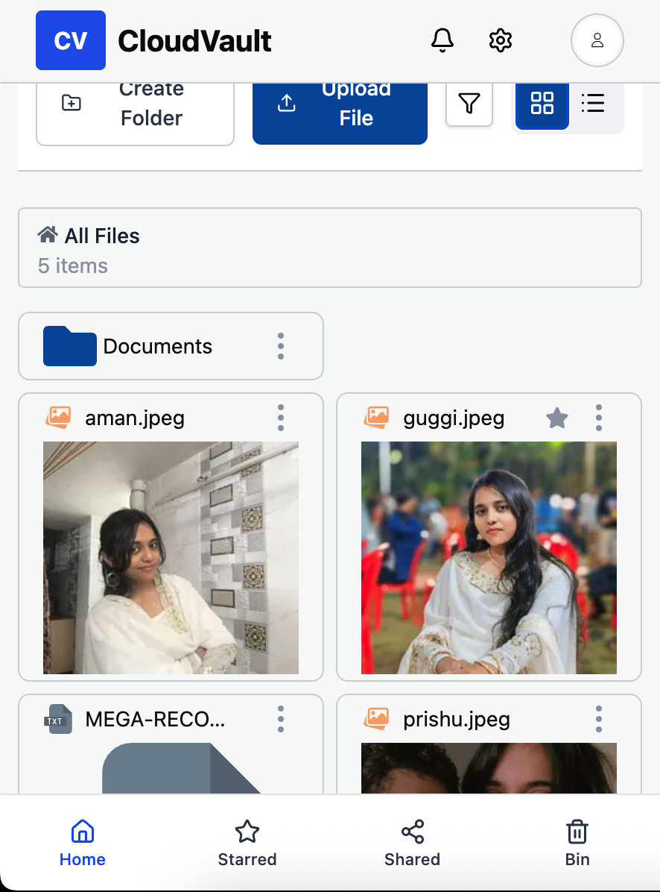
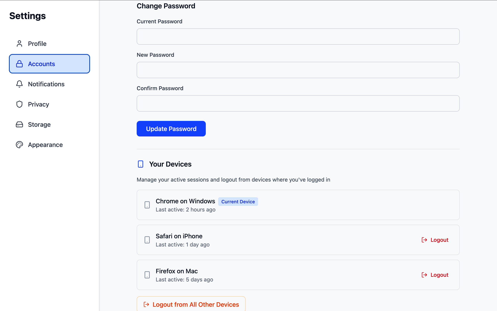

# 📁 Google Drive UI Clone (React + Tailwind)

A **Google Drive–style file manager UI** built using **React** and **Tailwind CSS**, focused on **frontend architecture, interaction patterns, and real-world UI behavior**.

## ✨ Features

- 🔐 Secure auth + session handling
- ⚡ Google OAuth (One Tap) & GitHub OAuth
- 🔔 Real-time notifications
- 📱 Multi-device login & logout
- 📂 Upload files from google drive
- 📤 File upload, rename, delete
- 📁 Folder structure
- ⭐ Starred files
- 🗑️ Recycle bin system
- Redis based session management

## Screenshots

### Landing Page
 

### Desktop

### Preview

### Mobile

### Settings

